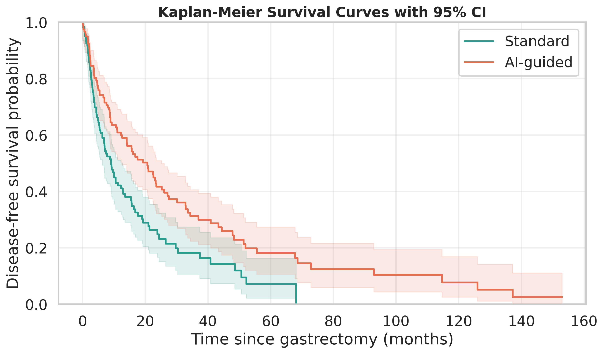
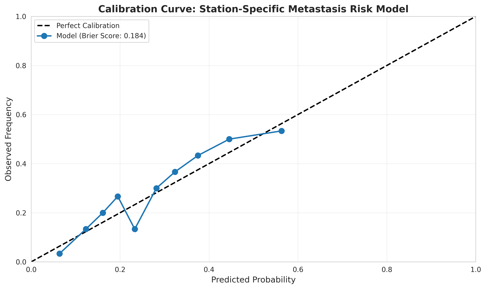

# Medical AI Validation Tools

Quantitative survival validation and probabilistic calibration workflows for AI-guided KLASS-standardized gastrectomy research.

## Why It Matters

Prospective surgical AI deployments rise or fall on whether model predictions translate into measurable survival gains. This notebooked toolkit links station-level metastasis risk models to disease-free survival endpoints, mirroring the validation pipeline I am developing for my PhD.

## Executive Snapshot

- Builds synthetic but clinically informed cohorts that contrast standard versus AI-guided gastrectomy.
- Quantifies survival benefit (Kaplan-Meier, log-rank, Cox proportional hazards) and probabilistic trustworthiness (Brier score, calibration slope/intercept, ECE).
- Benchmarks calibration remedies (raw model, Platt scaling, isotonic regression) to surface an evidence-based operating point.

## Repository Roadmap

- **Notebook**: `survival_and_calibration_enhanced.ipynb` · Sections mirror a real-world validation protocol.
- **Plots**: `kaplan_meier_example.png`, `calibration_curve_example.png` · Auto-generated evidence for quick review.
- **Script**: `demo_quickstart.py` · Headless quickstart that reproduces the notebook's core metrics.

## Getting Started

### 1. Reproducible Environment

The analyses were developed on Ubuntu 22.04, Python 3.11, 16 GB RAM. Estimated runtime < 1 minute.

```bash
# create environment (mamba or conda recommended)
mamba create -n med-ai-validation python=3.11
mamba activate med-ai-validation

# install runtime dependencies
pip install -r requirements.txt

# optional tooling for testing & CI linting
pip install -r requirements-dev.txt
```

### 2. Quickstart

```bash
# Smoke-test the end-to-end workflow
python demo_quickstart.py

# Explore the richer analysis
jupyter notebook survival_and_calibration_enhanced.ipynb

# Run lightweight regression tests
pytest test_demo_quickstart.py
```

## Analysis Highlights

- **Survival Outcomes** – Kaplan-Meier curves with 95 % CIs, log-rank hypothesis test, and Cox PH hazard ratios with confidence bounds.
- **Calibration Stress-Test** – Raw model, Platt-scaled, and isotonic-calibrated probability estimates with Brier score, calibration slope/intercept, and Expected Calibration Error (ECE).
- **Summary Dashboard** – Consolidated report of cohort statistics, discrimination (time-dependent concordance), and calibration quality flags aligned with surgical AI acceptance criteria.





## Key Metrics & Interpretation

- **Log-Rank p-value** < 0.05 indicates statistically significant survival divergence between arms.
- **Hazard Ratio (HR)** with 95 % CI grounds the effect size; HR < 1 favors AI-guided intervention.
- **Brier Score** quantifies probabilistic accuracy; values ≈0.05–0.10 reflect clinically actionable calibration.
- **Calibration Slope & Intercept** reveal under/over-confidence trends; post-calibration slope ≈1, intercept ≈0 is the target.
- **Expected Calibration Error (ECE)** ≤ 0.05 is the acceptance bar for deployment-readiness in the proposed validation protocol.

## Validation Workflow Blueprint

1. **Scenario Definition** – Construct station-specific metastasis risk predictions mapped to surgical interventions.
2. **Outcome Modeling** – Compare survival trajectories with non-parametric (Kaplan-Meier) and semi-parametric (Cox PH) approaches.
3. **Calibration Remediation** – Iterate on probabilistic outputs using Platt scaling and isotonic regression.
4. **Decision Readout** – Package metrics, plots, and a textual narrative for institutional review board (IRB) and multi-disciplinary tumor board stakeholders.
